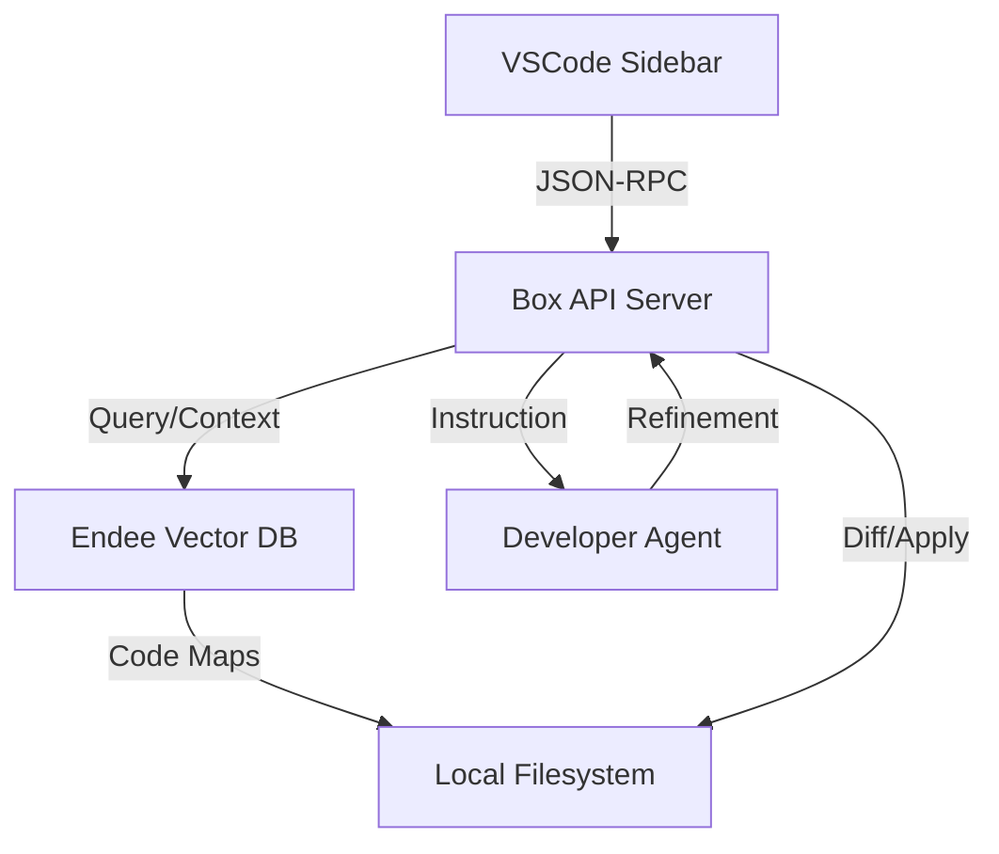

# 🏗️ Box Architecture

Box is designed with a "Single Source of Truth" architecture, where all repository knowledge resides in the **Endee Vector Database**.

## System Overview

### 1. Vector Awareness (Endee)
Box uses `all-MiniLM-L6-v2` to embed code chunks into Endee. This allows the system to find relevant code by "meaning" rather than just keyword matches.

### 2. Autonomous Loop
When a developer makes a request (e.g., "Refactor the search logic"), the **Developer Agent**:
1. Queries Endee for the most relevant files.
2. Reads the current files into context.
3. Uses the LLM (OpenAI or Local) to generate the updated code.
4. Returns the result to the IDE for validation/application.

### 3. IDE Connectivity
The VSCode extension acts as a thin client that handles the UI (Webview) and file system interactions (applying diffs).
