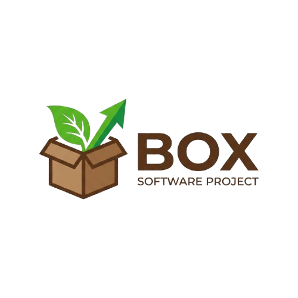

<p align="center">
  
</p>

<p align="center">
    <b>The industrial autonomous engine powered by [Endee](https://endee.io)'s high-performance vector core.</b>
</p>

---

## 🤝 Endee Ecosystem Collaboration

<p align="center">
  <picture>
      <source media="(prefers-color-scheme: dark)" srcset="docs/assets/logo-dark.svg">
      <source media="(prefers-color-scheme: light)" srcset="docs/assets/logo-light.svg">
      
  </picture>
</p>

**Box** is designed to work in perfect symphony with **Endee**. While Endee handles the heavy lifting of high-performance vector storage and hardware-optimized indexing, Box provides the agentic "brain" and developer orchestration.

### 🔄 The Partnership Stack

*   **⚡ Endee Core (The Muscle)**: A high-performance vector database written in C++. It handles **AVX2/SVE2 optimized search**, multi-threaded indexing, and enterprise-grade snapshot management.
*   **🧠 Box Intelligence (The Brain)**: A sophisticated agentic layer that orchestrates **Autonomous Tasks**, **Semantic Memory**, and **Hybrid Retrieval (Dense + Sparse)** to deliver human-like codebase awareness.
*   **🧩 Integrated Vibe Platform**: A unified suite including the **Vibe Dashboard**, **Mini Chat Box**, and **VSCode Sidebar** for a seamless, cross-platform development experience.

| Feature | Endee Core Layer | Box Intelligence Layer |
| :--- | :--- | :--- |
| **Search** | Exact & ANN Vector Matching | Hybrid Re-ranking & Contextualization |
| **Memory** | Low-latency Document Storage | Agentic Observation & Goal Recall |
| **Tasks** | High-speed Metadata Filtering | Plan Generation & Outcome Tracking |
| **Storage** | Compressed Vector Chunks | Delta-Optimized File Manifests |

## ✨ Platform Capabilities

```text
🛸 Mini Chat Experience (Vibe UI)
```
A sleek, glassmorphic floating chat interface inspired by Antigravity. It enables real-time repo-chat and model toggling directly from your dashboard or IDE.

```text
⚡ Box Turbo (Delta-Indexing)
```
Proprietary manifest-based indexing that re-processes only changed files, offering up to 20x faster updates for large repositories.

```text
🧠 Agentic Task Orchestration
```
Autonomous goal tracking and history management. The agent plans, executes, and "remembers" tasks using the specialized `box_tasks` vector index.

```text
☁️ Multi-Cloud Sync
```
Integrated backup hooks for Google Drive, Proton, and other cloud-mounted drives to ensure your intelligence core is always persistent.

## 🏗️ Architecture

```text
┌──────────────────────────────────────────────────────────┐
│              Autonomous Developer Interface               │
│   ┌──────────────┐      ┌──────────────┐      ┌───────┐  │
│   │ CLI (box)    │ <──> │ VSCode Side  │ <──> │ API   │  │
│   └──────┬───────┘      └──────┬───────┘      └───┬───┘  │
└──────────│─────────────────────│──────────────────│──────┘
           │                     │                  │
           └─────────────────────┴──────────────────┘
                         │
┌────────────────────────▼─────────────────────────────────┐
│                 Box API Server (Port 8000)               │
│      (FastAPI, DeveloperAgent, Contextual Memory)        │
└────────────────────────┬─────────────────────────────────┘
                         │
┌────────────────────────▼─────────────────────────────────┐
│              Endee Vector Database (Port 8080)           │
│   ┌─────────────┐     ┌─────────────┐     ┌──────────┐   │
│   │ Dense Index │     │ Sparse Index│     │ Filters  │   │
│   └─────────────┘     └─────────────┘     └──────────┘   │
└──────────────────────────────────────────────────────────┘
```

---

## 🚀 Getting Started

### 1 — One-Click Setup (Master Suite)
Initialize the entire environment (Dependencies, PATH, and Initial Indexing) with a single command:

**Windows:**
```powershell
.\setup.bat
```

**Linux / macOS / BSD:**
```bash
chmod +x setup.sh && ./setup.sh
```

### 2 — Starting the Intelligence Layer
Launch the Box API Server to enable IDE and external tool connectivity:
```bash
box serve  # (Or ./box.sh serve)
```

### 3 — Building the Sidebar (VSCode)
To use the included IDE extension, use our build tool to compile the TypeScript source:

**Windows:**
```powershell
.\ide\vscode\build.bat
```

**Linux / macOS / BSD:**
```bash
chmod +x ide/vscode/build.sh && ./ide/vscode/build.sh
```

---

## 🛠️ Usage Workflow

### 1. Codebase Awareness
Before using the AI, ensuring your index is fresh.
```bash
box index
```

### 2. Autonomous IDE Chat
1. Launch the API: `box serve`
2. Open VSCode and navigate to the **Box Engine** activity bar icon.
3. Start chatting with your codebase! Box uses hybrid semantic search to find relevant context automatically.

### 3. Agentic Development
Use the CLI for direct autonomous improvements:
```bash
box search "logic for vector upsert" --top_k 3
```
Or use the context-aware `develop` API via the VSCode extension commands (`Box: Ask about current file`).

---

## 📂 Project Structure

| Directory | Content |
| :--- | :--- |
| **`box/`** | 🧠 The core Intelligence Engine (CLI, Server, Logic). |
| **`ide/`** | 🧩 IDE extension source code and build tools. |
| **`docs/`** | 📖 Comprehensive technical guides (Memory, Filtering, Sparse). |
| **`data/`** | 📂 Sample datasets for initial evaluation. |
| **`box.bat` / `box.sh`** | 🚀 Unified entry points for Windows and UNIX-like systems. |

## ⚙️ CLI Reference

Use `box` (if installed to PATH) or `./box.sh` / `.\box.bat`:

- `box index` - Scans and indexes the current codebase.
- `box search "query"` - Performs a hybrid semantic lookup.
- `box status` - Real-time system health and connectivity check.
- `box backup create` - Generates a snapshot of your index.

---

## 🏗️ Technical Details
- **Architecture**: Multi-layered (DB <-> API <-> IDE)
- **Platforms**: Windows, Linux (Ubuntu/Debian/RHEL/Fedora), macOS (arm64), FreeBSD/OpenBSD/NetBSD.
- **Dependencies**: Python 3.10+, Node.js (for IDE), C++17 Compiler (for core build).

## 🛡️ License

Endee is open-source software licensed under the **Apache License 2.0**. For enterprise support or branding permissions, contact [enterprise@endee.io](mailto:enterprise@endee.io).

---
<p align="center">
    <b>Built with performance in mind for all major operating systems.</b>
</p>
