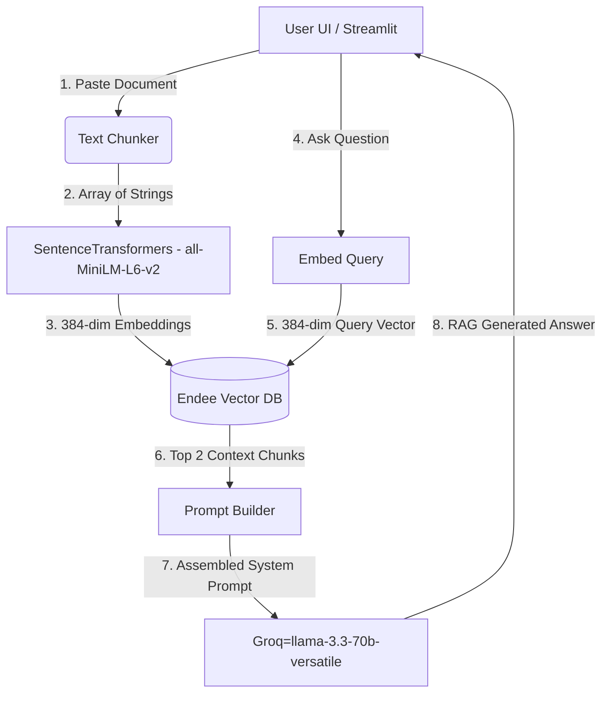

# ResearchFlow AI 🧠

## Project Overview
ResearchFlow AI is an advanced Retrieval-Augmented Generation (RAG) application designed for technical document retrieval and synthesis. Built natively for the **Endee Vector Database Challenge**, this tool allows users to upload complex technical texts, convert them into vector embeddings, and seamlessly retrieve the most relevant chunks to answer queries via llama-3.3-70b-versatile.

By leveraging the high-speed Endee Vector Database, ResearchFlow AI performs extremely efficient cosine similarity searches, routing context-aware knowledge to Large Language Models in milliseconds.

## System Design



## Why Endee?

Endee powers the core retrieval engine of ResearchFlow AI. It was chosen for its unparalleled performance characteristics, specifically suited for rapid RAG workloads:

* **C++ Backend Speed:** Endee is written natively in C++, allowing it to bypass the overhead of interpreted languages and deliver extreme throughput locally and in the cloud.
* **SIMD Optimization:** Utilizing Single Instruction, Multiple Data (SIMD) hardware-accelerated instructions, Endee performs cosine similarity calculations across multiple vectors precisely in parallel, massively accelerating vector search.
* **Efficient Memory Footprint:** Keeps active embeddings memory-resident at optimal structures for extremely rapid top-k nearest neighbor retrieval compared to legacy DBs.

## Setup Instructions

1. **Clone the repository:**
   ```bash
   git clone <your-repo-url>
   cd <your-repo-directory>
   ```

2. **Set up a Python Virtual Environment:**
   ```bash
   python -m venv venv
   # On Windows:
   venv\Scripts\activate
   # On Linux/macOS:
   source venv/bin/activate
   ```

3. **Install Dependencies:**
   ```bash
   pip install -r requirements.txt
   ```

4. **Environment Variables:**
   You will need to configure your OpenAI API key to power the generation side of the RAG pipeline.
   ```bash
   # Linux / macOS
   export GROQ_API_KEY="your-groq-api-key"
   
   # Windows (Powershell)
   $env:Groq_API_KEY="your-Groq-api-key"
   ```

5. **Start Endee Vector DB:**
   Ensure your Endee database is running locally. By default, the `endee` Python client attempts to connect to `http://localhost:8081`.
   If running via docker:
   ```bash
   docker run -d -p 8081:8080 endee/endee:latest
   ```

6. **Run the Streamlit Application:**
   ```bash
   streamlit run app.py
   ```
   Navigate to the URL provided in the terminal (typically `http://localhost:8501`) to start interacting with ResearchFlow AI!
