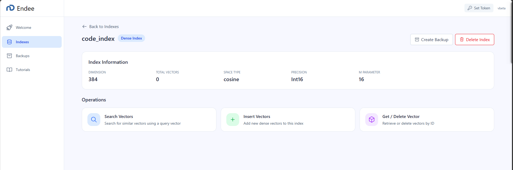
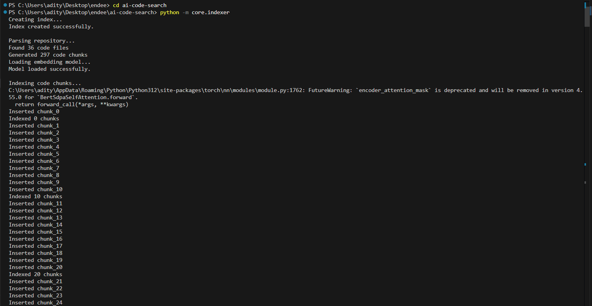
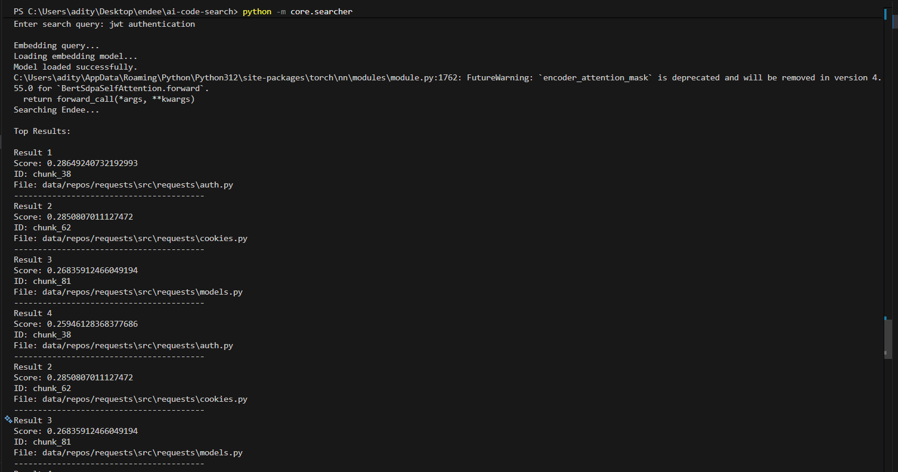

# 🔎 AI Semantic Code Search using Endee

## 📌 Overview

This project implements an **AI-powered semantic code search system** built on top of the **Endee Vector Database**.

Traditional code search relies on keyword matching, which often fails to retrieve relevant results when the exact keywords are not present. This project solves that problem by using **vector embeddings and semantic similarity search**.

The system indexes source code from GitHub repositories, converts the code into vector embeddings using **Sentence Transformers**, and stores those vectors in the **Endee vector database**. Users can then search for relevant code snippets using **natural language queries**.

---

## 🧠 How It Works

The system performs semantic search using the following pipeline:

GitHub Repository
↓
Repository Loader
↓
Code Parser
↓
Code Chunking
↓
Embedding Model (Sentence Transformers)
↓
Endee Vector Database
↓
Semantic Code Search

---

## 📂 Project Structure

ai-code-search/
│
├── core/
│ ├── embedder.py # Generates vector embeddings
│ ├── indexer.py # Inserts embeddings into Endee
│ └── searcher.py # Performs semantic vector search
│
├── scripts/
│ ├── repo_loader.py # Clones GitHub repositories
│ └── code_parser.py # Parses and chunks source code
│
├── data/
│ └── repos/ # Downloaded repositories
│
├── screenshots/
│ ├── endee_dashboard.png
│ ├── indexing_process.png
│ └── search_results.png
│
└── README.md

---

## ✨ Features

- Clone GitHub repositories automatically
- Extract and parse source code files
- Split code into chunks for indexing
- Generate embeddings using **Sentence Transformers**
- Store vectors in **Endee Vector Database**
- Perform **semantic search using natural language queries**
- Retrieve relevant code files based on meaning instead of keywords

---

## 🔍 Example Search

Example user query: jwt authentication

### Example Output

Result 1
Score: 0.286
File: data/repos/requests/src/requests/auth.py

Result 2
Score: 0.285
File: data/repos/requests/src/requests/cookies.py

The system identifies relevant code files related to authentication even if the query wording differs.

---

## 🖼 Screenshots

### 1️⃣ Endee Vector Index Dashboard

Shows the indexed vectors stored in Endee.

---

### 2️⃣ Indexing Process

Terminal output while indexing a repository.

---

### 3️⃣ Semantic Search Results

Search results returned for a natural language query.

---

## ⚙️ Setup Instructions

### 1️⃣ Clone the Repository

git clone https://github.com/GitNinja4/endee
cd ai-code-search

---

### 2️⃣ Install Dependencies

pip install sentence-transformers requests msgpack

---

### 3️⃣ Start Endee Vector Database

Run the following command from the root directory:

docker compose up -d

Open Endee dashboard: http://localhost:8080

---

### 4️⃣ Index a Repository

Run the indexing pipeline: python -m core.indexer

This step:

- parses source code
- generates embeddings
- stores vectors in Endee

---

### 5️⃣ Run Semantic Search

Run the search engine: python -m core.searcher

python -m core.searcher

Example query: jwt authentication

The system returns the most relevant code files based on semantic similarity.

---

## 🛠 Technologies Used

- Python
- Sentence Transformers
- Endee Vector Database
- Docker
- Git
- Vector Similarity Search

---

## 🚀 Future Improvements

Possible extensions for this project include:

- returning actual **code snippets** instead of just file paths
- adding a **FastAPI backend for search API**
- building a **web interface for code search**
- indexing multiple repositories automatically
- ranking results using additional metadata

---

## 📄 License

This project is developed for experimentation and learning purposes using vector databases and semantic search.