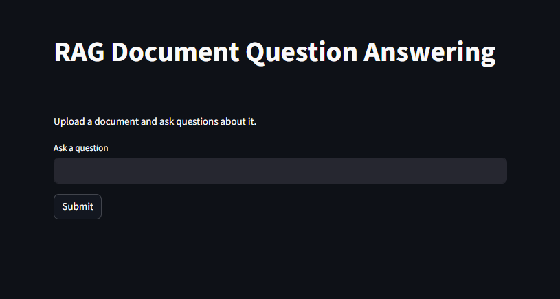

# Endee AI Knowledge Assistant

## Project Overview
Endee AI Knowledge Assistant is an AI-powered question answering system built using Retrieval-Augmented Generation (RAG). The system allows users to ask natural language questions and receive context-aware answers by retrieving relevant information from a knowledge base.

The system integrates semantic search, vector databases, and language models to provide intelligent responses.

---

## Problem Statement

Organizations store large amounts of information across documents and databases. Traditional search systems rely on keyword matching and often fail to understand the meaning of user queries.

Challenges include:

- Fragmented information sources
- Slow knowledge retrieval
- Inefficient keyword-based search
- Difficulty extracting insights from large datasets

This project solves these challenges using an AI-powered semantic retrieval system.

---

## System Design and Technical Approach

The project follows a Retrieval-Augmented Generation (RAG) pipeline.

### Workflow

1. User submits a question through the interface
2. Question is converted into embeddings
3. Vector database performs similarity search
4. Relevant knowledge is retrieved
5. AI model generates the final response

### Architecture

User  
  ↓  
Frontend (Streamlit)  
  ↓  
Backend API (FastAPI)  
  ↓  
Embedding Model (Sentence Transformers)  
  ↓  
Vector Database (FAISS)  
  ↓  
Context Retrieval  
  ↓  
AI Response Generation  

---

## How Endee is Used

The project demonstrates Endee-style AI architecture principles including:

- Semantic embedding generation
- Vector database indexing
- Context-based retrieval
- AI-powered reasoning using retrieved knowledge

This allows the system to generate accurate answers grounded in actual information.

---

## Technology Stack

Frontend
- Streamlit

Backend
- FastAPI

AI Models
- Sentence Transformers

Vector Database
- FAISS

Programming Language
- Python

---

## Setup Instructions

### 1 Clone Repository
### 2 Create Virtual Environment
### 3 Install Dependencies

---

## Running the Project
Start backend  -  uvicorn backend.api:app --reload

Start frontend  -  streamlit run frontend/app.py

Open browser -  http://localhost:8501
---

## Example Questions

- What is Retrieval Augmented Generation?
- Explain vector databases
- What is semantic search?

---

## Future Improvements

- Chat memory
- Multi-document knowledge ingestion
- Scalable vector databases
- Improved answer citations

---

## Conclusion

This project demonstrates how AI-powered retrieval systems can improve knowledge discovery and enable intelligent question answering using modern machine learning techniques.
