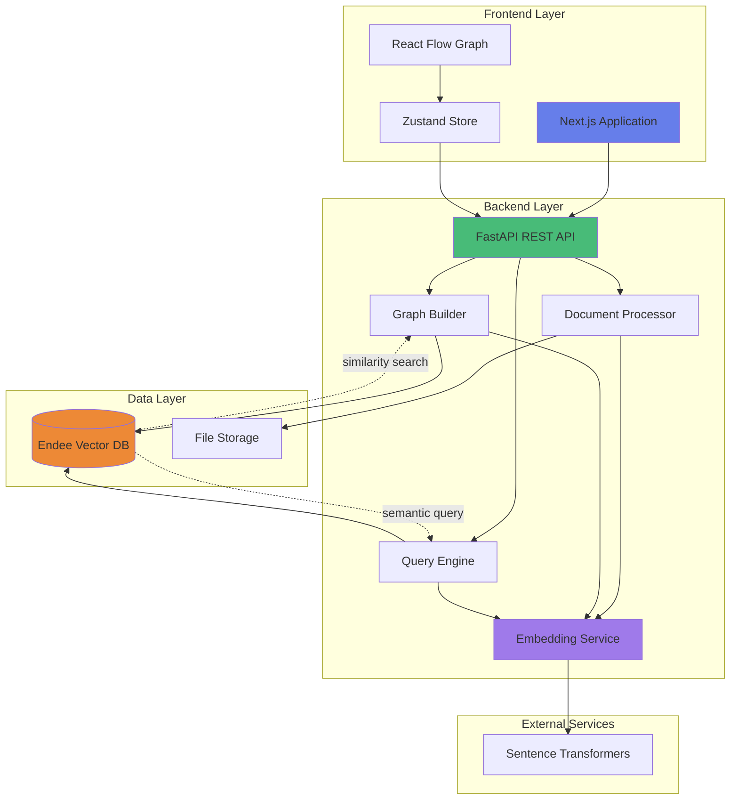
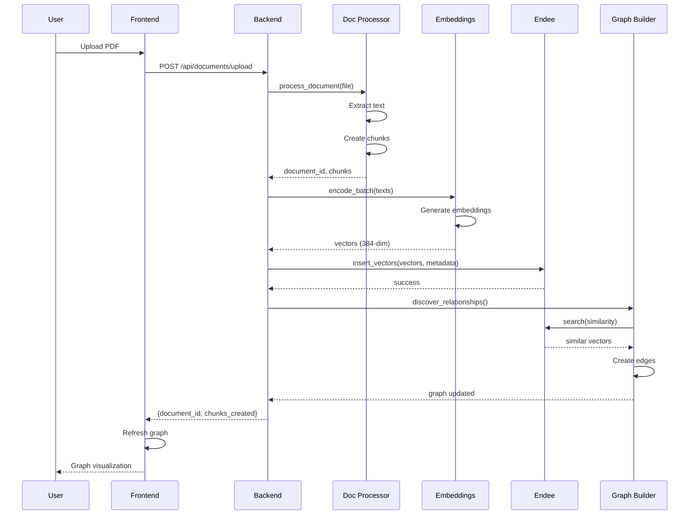
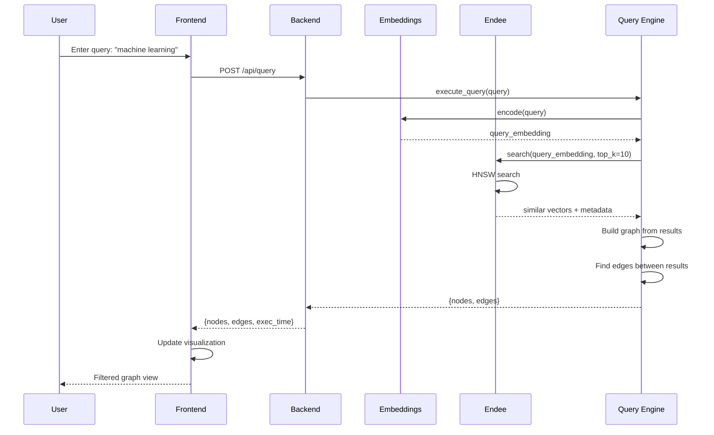

# Nexus Architecture Diagram

## System Components



## Data Flow: Document Upload



## Data Flow: Semantic Query



## Component Interactions

### 1. Document Processing Pipeline

```
PDF/TXT/DOCX → Text Extraction → Chunking → Embedding
                                              ↓
                                    Store in Endee (384-dim vectors)
                                              ↓
                                    Similarity Search (cosine)
                                              ↓
                                    Graph Construction (nodes + edges)
```

### 2. Graph Building Logic

```
For each new chunk embedding:
  1. Search Endee for top-K similar vectors (threshold > 0.7)
  2. Create GraphNode for chunk
  3. Create GraphEdge for each similar result
  4. Update global graph structure
```

### 3. Query Execution Flow

```
User Query → Embed Query → Search Endee → Retrieve Nodes
                                              ↓
                              Find Edges Between Nodes
                                              ↓
                              Return Sub-graph
```

## Technology Stack Diagram

```
┌─────────────────────────────────────────┐
│         Frontend (Next.js)              │
│  ┌────────────┐      ┌───────────────┐ │
│  │ React Flow │      │ Tailwind CSS  │ │
│  └────────────┘      └───────────────┘ │
│  ┌────────────┐      ┌───────────────┐ │
│  │   Zustand  │      │  TypeScript   │ │
│  └────────────┘      └───────────────┘ │
└─────────────┬───────────────────────────┘
              │ HTTP/REST
┌─────────────▼───────────────────────────┐
│       Backend (FastAPI)                 │
│  ┌────────────────────────────────────┐ │
│  │   Document Processor               │ │
│  │   - PyPDF2, python-docx            │ │
│  └────────────────────────────────────┘ │
│  ┌────────────────────────────────────┐ │
│  │   Embedding Service                │ │
│  │   - sentence-transformers          │ │
│  │   - all-MiniLM-L6-v2 (384-dim)     │ │
│  └────────────────────────────────────┘ │
│  ┌────────────────────────────────────┐ │
│  │   Graph Builder                    │ │
│  │   - Relationship discovery         │ │
│  │   - Node/Edge construction         │ │
│  └────────────────────────────────────┘ │
└─────────────┬───────────────────────────┘
              │ HTTP/REST
┌─────────────▼───────────────────────────┐
│      Endee Vector Database (C++)        │
│  ┌────────────────────────────────────┐ │
│  │   HNSW Index                       │ │
│  │   - Fast similarity search         │ │
│  │   - Cosine distance                │ │
│  └────────────────────────────────────┘ │
│  ┌────────────────────────────────────┐ │
│  │   Quantization                     │ │
│  │   - INT8, FP16 support             │ │
│  └────────────────────────────────────┘ │
│  ┌────────────────────────────────────┐ │
│  │   Crow REST API                    │ │
│  └────────────────────────────────────┘ │
└─────────────────────────────────────────┘
```

## Deployment Architecture

```
┌──────────────────────────────────────────────┐
│              Vercel (Frontend)               │
│           ┌─────────────────┐                │
│           │   Next.js App   │                │
│           └─────────────────┘                │
└────────────────┬─────────────────────────────┘
                 │ HTTPS
┌────────────────▼─────────────────────────────┐
│           Render/Railway (Backend)           │
│      ┌──────────────────────────────┐        │
│      │   FastAPI + Uvicorn          │        │
│      │   Python 3.10+               │        │
│      └──────────────────────────────┘        │
└────────────────┬─────────────────────────────┘
                 │ HTTP
┌────────────────▼─────────────────────────────┐
│           Docker Container (Endee)           │
│      ┌──────────────────────────────┐        │
│      │   Endee Vector Database      │        │
│      │   C++ Binary                 │        │
│      └──────────────────────────────┘        │
│      ┌──────────────────────────────┐        │
│      │   Persistent Volume          │        │
│      │   (Vector Storage)           │        │
│      └──────────────────────────────┘        │
└──────────────────────────────────────────────┘
```

## Performance Characteristics

### Latency Breakdown (typical request)

```
User Query: "machine learning"
    ↓
Frontend: 5ms (state update)
    ↓
Network: 20ms (HTTP)
    ↓
Backend: 15ms (API processing)
    ↓
Embedding: 50ms (GPU) / 200ms (CPU)
    ↓
Endee Search: 5ms (10K vectors)
    ↓
Graph Build: 10ms
    ↓
Network: 20ms (response)
    ↓
Frontend Render: 16ms (60 FPS)
    ↓
Total: ~141ms (GPU) / ~291ms (CPU)
```

### Scalability Points

- **Endee**: Horizontal scaling with sharding
- **Backend**: Stateless, load balancer ready
- **Frontend**: CDN distribution, edge rendering
- **Embeddings**: GPU acceleration, batch processing

---

This architecture demonstrates:
- **Clean separation of concerns**
- **Vector-native design**  
- **Production-ready scalability**
- **Modern best practices**
