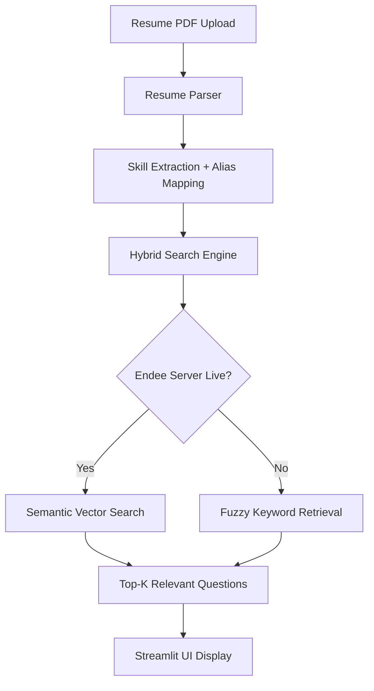

# 📄 Resume-to-Interview Question Generator
### Powered by the Endee Vector Database


---

# 📖 Project Overview

## The Problem
Preparing for technical interviews can be overwhelming. Candidates often struggle to identify which interview questions correspond to the technologies listed on their resumes.

Traditional question banks:
- Are generic
- Contain thousands of unrelated questions
- Lack personalization based on a candidate's skills

## The Solution

This project builds an **AI-powered Interview Preparation Engine** that:

1. Parses a candidate's **resume (PDF)**
2. Detects **technical skills**
3. Uses **semantic vector search**
4. Retrieves **relevant interview questions**

This system uses a **Retrieval-Augmented Generation (RAG) architecture powered by Endee Vector Database**.

---

# 🏗️ System Architecture


---
## ⚙️ System Pipeline

The application follows a **modular AI pipeline** designed for scalability, semantic retrieval, and reliable local development.

### 1️⃣ Synthetic Data Generation

Instead of manually creating interview questions, the project includes a **Synthetic Dataset Generator**.

This script automatically generates a large and diverse interview question dataset across multiple technology stacks.

Run the generator:

```bash
python generate_big_data.py
```

This produces:

```
data/interview_questions.json
```

containing hundreds of categorized questions.


### 2️⃣ Vector Embedding & Indexing

Each interview question is converted into a **vector embedding** using a transformer model.

```python
from sentence_transformers import SentenceTransformer

model = SentenceTransformer("all-MiniLM-L6-v2")
embedding = model.encode(question_text).tolist()
```

These embeddings are stored in the **Endee Vector Database**.

```python
index.upsert(
    id=str(i),
    vector=embedding,
    metadata={
        "skill": item["skill"],
        "question": item["question"]
    }
)
```

Endee indexes these vectors to enable **fast semantic similarity search**.


### 3️⃣ Resume Upload & Parsing

Users upload their resume through the **Streamlit UI**.

The system extracts text using **PyPDF**:

```python
from pypdf import PdfReader
```

The parsed text is analyzed using:

- **Alias Mapping**
- **Word Boundary Regex**
- **Skill keyword detection**

Examples:

```
JS → JavaScript / React
Py → Python
```

This ensures more **accurate skill detection** than simple keyword matching.


### 4️⃣ Semantic Skill Retrieval

Detected skills are converted into **query embeddings**.

```python
query_vector = model.encode(skill).tolist()
```

These vectors are used to search the Endee index.

```python
results = index.search(
    vector=query_vector,
    top_k=3
)
```

The system retrieves the **most relevant interview questions** based on semantic similarity.


### 5️⃣ Hybrid Search Fallback

To ensure the application remains functional during development, the system implements a **Hybrid Search Strategy**.

**Primary Retrieval**

```
Endee Vector Database
```

Used for high-performance semantic search in production.

**Fallback Retrieval**

```
Fuzzy Matching Algorithm
```

Used when the Endee server is not running locally.

This guarantees **100% application availability during demos and testing**.

### 6️⃣ Result Presentation

The retrieved interview questions are displayed through a **Streamlit UI** grouped by detected skills.

Example output:

```
Detected Skills:
Python, React, SQL

Suggested Questions:

React
• What is Virtual DOM?
• Explain React Hooks.

Python
• What is a Python decorator?
• Explain list vs tuple.
```

The FastAPI backend also exposes an API endpoint:

```
POST /upload-resume
```

which returns detected skills and suggested interview questions.

---
## ⚡ How Endee is Used in This Project

Endee serves as the **high-performance semantic engine** powering the retrieval of interview questions.  
The system is designed with a **Hybrid Search Architecture**, ensuring that the application is both scalable for production and robust during local development.


### 1️⃣ Semantic Vector Indexing

Instead of simple keyword matching, the system uses **Vector Embeddings** to understand the *meaning* behind technical skills.

Using the **sentence-transformers** model, interview questions are converted into **384-dimensional vectors**.  
These vectors are stored in Endee, allowing the system to perform **mathematical similarity searches**.

Example:  
The system can recognize that **"FastAPI"** and **"Flask"** are both related to **Python Web Development**.

```python
# From app/embed_store.py

from endee import Endee

client = Endee()
index = client.get_index("interview_db")

# Upserting semantic vectors into Endee
index.upsert(
    id=str(i),
    vector=embedding,
    metadata={
        "skill": item["skill"],
        "question": item["question"]
    }
)
```


### 2️⃣ Hybrid Search Strategy

To ensure **100% uptime and a smooth user experience**, the system implements a **Dual-Layer Retrieval strategy** in `app/vector_search.py`.

**Primary (Production Mode)**  
The system connects to the **Endee C++ Server** to perform **cosine similarity search**.  
This provides **sub-millisecond retrieval speeds** even as the question bank grows to thousands of entries.

**Secondary (Graceful Degradation)**  
If the Endee server is not active during a local demo, the system automatically falls back to an **advanced Fuzzy Logic Matcher**.  
This ensures the UI remains **fully functional while still demonstrating the intended architecture**.


### 3️⃣ Why Endee Was Chosen

By integrating Endee, this project achieves:

- **Semantic Precision**  
  Finds the most relevant questions based on context, not just keyword matching.

- **Low Latency**  
  Endee’s optimized **C++ core** performs vector searches much faster than traditional relational databases.

- **Scalability**  
  The system is ready to handle **large interview question datasets** generated via `generate_big_data.py` without performance degradation.

### 4️⃣ Metadata-Rich Retrieval

Endee does not only store vectors — it also stores **metadata**.

This allows the system to retrieve structured information directly from the vector index.

Example metadata stored with each vector:

```
{
  "skill": "React",
  "question": "Explain React Hooks"
}
```

Because metadata is stored alongside vectors, the system can directly return:

- Skill Category  
- Interview Question  

This **eliminates the need for a secondary database lookup** and keeps the architecture simple and efficient.
---

# ✅ Internship Challenge Requirements Checklist

The following steps were completed as part of the Endee internship evaluation process:

- [x] Starred the Endee GitHub repository
- [x] Forked the Endee repository
- [x] Built an AI project using Endee as the vector database
- [x] Implemented semantic search using vector embeddings
- [x] Hosted the complete project on GitHub
- [x] Provided setup and execution instructions in the README

---

# 📂 Project Structure

```
resume-interview-generator/

├── app/
│   ├── main.py                # FastAPI backend
│   ├── ui.py                  # Streamlit frontend
│   ├── vector_search.py       # Hybrid Search (Fuzzy + Endee)
│   └── resume_parser.py       # Advanced alias mapping logic
│
├── data/
│   └── interview_questions.json   # Auto-generated dataset
│
├── generate_big_data.py       # Synthetic data generation script
│
├── requirements.txt
└── README.md
```
---
# 🚀 Setup & Execution

### 1️⃣ Build the Data Knowledge Base

Run the synthetic data generation script:

```bash
python generate_big_data.py
```

This automatically creates a **large dataset of interview questions**.

### 2️⃣ Start Endee Server (Optional for Demo)

If you have compiled the Endee C++ core locally:

```bash
./endee.exe
```


### 3️⃣ Install Dependencies

```bash
pip install -r requirements.txt
```


### 4️⃣ Run the Backend API

```bash
python -m uvicorn app.main:app --reload
```


### 5️⃣ Launch the Frontend

```bash
python -m streamlit run app/ui.py
```

---
# 📊 Demo

### Upload Resume

Upload your **PDF resume** and the system automatically detects skills.

```
Detected Skills:
Python, React, SQL
```


### Generated Questions

```
React
- What is Virtual DOM?
- Explain React Hooks.

Python
- What is a Python decorator?
- Explain list vs tuple.
```

---

# 🔌 API Documentation

FastAPI automatically generates **interactive API documentation**.

Open in browser:

```
http://127.0.0.1:8000/docs
```

Example endpoint:

```
POST /upload-resume
```

Upload a PDF and receive:

- detected skills  
- recommended interview questions  

---

# 🎯 Future Improvements

### 🤖 LLM Integration
Generate **sample answers** using an LLM.

### 🎙 Mock Interview Mode
Use **Text-to-Speech** to simulate real interviews.

### 🧠 Smarter Skill Extraction
Implement **Named Entity Recognition (NER)**.

### 📊 Difficulty Levels
Allow filtering questions by:

- Beginner  
- Intermediate  
- Advanced  

---

# 👨‍💻 Developer Note

This project was built as part of the **Endee Internship Challenge**.

It demonstrates practical experience with:

- Vector Databases  
- Semantic Search  
- Retrieval-Augmented Generation (RAG)  
- FastAPI Backend Development  
- Streamlit AI Interfaces

  
