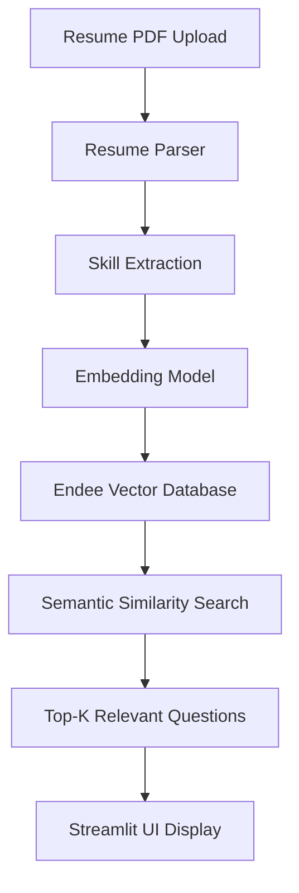

# 📄 Resume-to-Interview Question Generator
### Powered by the Endee Vector Database


---

# 📖 Project Overview

## The Problem
Preparing for technical interviews can be overwhelming. Candidates often struggle to identify which interview questions correspond to the technologies listed on their resumes.

Traditional question banks:
- Are generic
- Contain thousands of unrelated questions
- Lack personalization based on a candidate's skills

---

## The Solution

This project builds an **AI-powered Interview Preparation Engine** that:

1. Parses a candidate's **resume (PDF)**
2. Detects **technical skills**
3. Uses **semantic vector search**
4. Retrieves **relevant interview questions**

This system uses a **Retrieval-Augmented Generation (RAG) architecture powered by Endee Vector Database**.

---

# 🏗️ System Architecture



## ⚙️ System Pipeline

### 1️⃣ Ingestion Phase

A dataset of interview questions is converted into vector embeddings.

```python
from sentence_transformers import SentenceTransformer

model = SentenceTransformer("all-MiniLM-L6-v2")
```

Each question becomes a **384-dimensional vector** and is stored in the **Endee Vector Database**.

---

### 2️⃣ Resume Processing

The user uploads a **PDF resume**.

```python
from pypdf import PdfReader

reader = PdfReader("resume.pdf")
text = ""

for page in reader.pages:
    text += page.extract_text()
```

Skills are extracted using **keyword matching and regex patterns**.

---

### 3️⃣ Semantic Retrieval

Extracted skills are converted into embeddings and searched in Endee.

```python
results = db.search(query_vector, top_k=3)
```

This retrieves **semantically similar interview questions**.

---

### 4️⃣ Presentation Layer

Questions are displayed in a **Streamlit interface** grouped by skill.

Example output:

```
Skill: React

• What is Virtual DOM?
• Explain React Hooks.
• How does React diffing algorithm work?
```

---

# 🛠️ Technical Stack

| Component | Technology |
|----------|------------|
| Vector Database | Endee |
| Embedding Model | sentence-transformers |
| Backend | FastAPI |
| Frontend | Streamlit |
| PDF Parsing | PyPDF |
| Programming Language | Python |

---

# 📂 Project Structure

```
resume-interview-generator/

├── app/
│   ├── main.py            # FastAPI backend API
│   ├── ui.py              # Streamlit frontend UI
│   ├── embed_store.py     # Script to seed Endee with vectors
│   ├── vector_search.py   # Endee semantic search logic
│   ├── resume_parser.py   # Resume PDF parsing
│   └── generator.py       # Orchestration pipeline
│
├── data/
│   └── questions.json     # Interview questions dataset
│
├── requirements.txt
└── README.md
```

---

# 🚀 Setup & Execution

### 1️⃣ Start Endee Server

```bash
./endee.exe
```

---

### 2️⃣ Install Dependencies

```bash
pip install -r requirements.txt
```

---

### 3️⃣ Seed the Vector Database

Convert interview questions into embeddings and store them in Endee.

```bash
python -m app.embed_store
```

---

### 4️⃣ Start Backend API

```bash
python -m uvicorn app.main:app --reload
```

---

### 5️⃣ Start Frontend

```bash
python -m streamlit run app/ui.py
```

---

# 📊 Demo

### Upload Resume

Upload your **PDF resume** and the system automatically detects skills.

```
Detected Skills:
Python, React, SQL
```

---

### Generated Questions

```
React
- What is Virtual DOM?
- Explain React Hooks.

Python
- What is a Python decorator?
- Explain list vs tuple.
```

---

# 🔌 API Documentation

FastAPI automatically generates **interactive API documentation**.

Open in browser:

```
http://127.0.0.1:8000/docs
```

Example endpoint:

```
POST /upload-resume
```

Upload a PDF and receive:

- detected skills  
- recommended interview questions  

---

# 🎯 Future Improvements

### 🤖 LLM Integration
Generate **sample answers** using an LLM.

### 🎙 Mock Interview Mode
Use **Text-to-Speech** to simulate real interviews.

### 🧠 Smarter Skill Extraction
Implement **Named Entity Recognition (NER)**.

### 📊 Difficulty Levels
Allow filtering questions by:

- Beginner  
- Intermediate  
- Advanced  

---

# 👨‍💻 Developer Note

This project was built as part of the **Endee Internship Challenge**.

It demonstrates practical experience with:

- Vector Databases  
- Semantic Search  
- Retrieval-Augmented Generation (RAG)  
- FastAPI Backend Development  
- Streamlit AI Interfaces  
